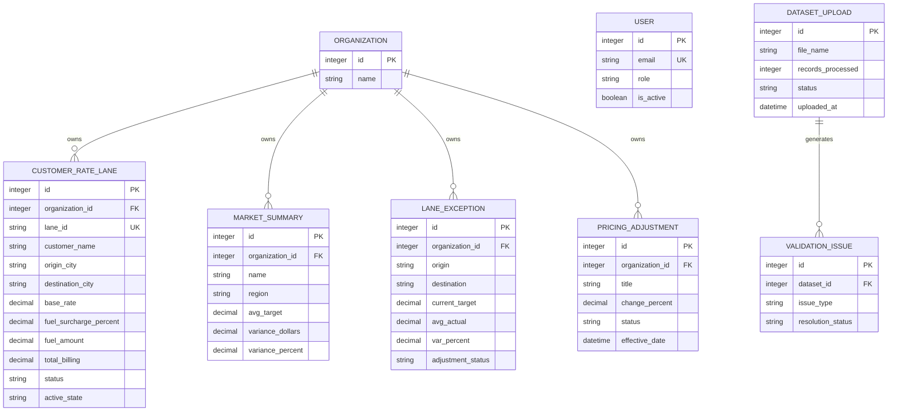

# Phase 7: Proposed Production Data Architecture

> [!TIP]
> The prior `Pricing_Logistics` Django implementation exists and already contains the core models needed for `PricingDirect`. This architecture builds upon those existing foundations.

## Entity-Relationship Diagram

## Table-Level Data Dictionary (PricingDirect Core)

| Model | Application | Primary Key | Key Fields | Source of Truth |
|---|---|---|---|---|
| `CustomerRateLane` | `rates` | ID | `lane_id`, `base_rate`, `fuel_surcharge_percent` | App DB |
| `MarketSummary` | `pricing` | ID | `name`, `avg_target`, `variance_percent` | App DB |
| `LaneException` | `pricing` | ID | `origin`, `destination`, `current_target` | App DB |
| `PricingAdjustment` | `pricing` | ID | `title`, `change_percent`, `effective_date` | App DB |

## Architecture Decisions & Pricing Formulas Discovered
- **Fuel Calculation**: The formula for calculating total billing is explicitly defined in `rates.models.CustomerRateLane.save()`: 
  `self.fuel_amount = base_rate * (fuel_surcharge_percent / 100)`
  `self.total_billing = base_rate + self.fuel_amount`
  *This confirms that rate calculations are authoritative on the Django backend.*
- **No Duplicate Models**: We will use `CustomerRateLane`, `MarketSummary`, `LaneException`, and `PricingAdjustment` exactly as they exist in `Pricing_Logistics`.
